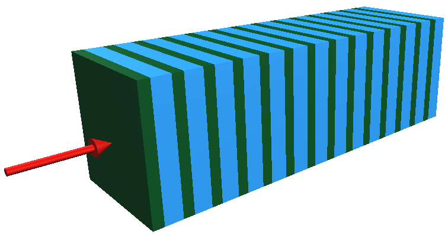

.. _simulation_components_doc:

The components of the simulation
=================================

The two main components of the simulation is the `Geometry`_ and `Physics`_ providing the necessary information and functionalities fused together
to compute the individual simulation steps during the `Event processing`_ inside the `Stepping loop`_, i.e. how far the particle goes
in a given simulation step and what happens with it at that post-step point.

The `Geometry`_ describes the simulation setup, including navigation possibilities or providing information on the **geometrical constraints for
the simulation step computation** (e.g. given a global point, how far the nearest volume boundary is or how far the volume boundary to a given
direction is, etc.). The `Physics`_ component is responsible to supply the **physics related constraints for the simulation step computation**
(e.g. how far the given particle go till its next interaction of the given type or how far a charge particle goes till it loses all its current
energy, etc.). These constraints are required during the `Event processing`_ at the beginning of each simulation step computation in the
`Stepping loop`_ to decide length of the simulation step. The particle is then moved to the post-step point and the necessary `Geometry`_
and/or `Physics`_ related **actions are performed** on the particle. Some information regarding the given simulation step, e.g. energy deposit,
might be collected at the end of each simulation step before performing the computation of the next step till the history of the particle is
terminated (e.g. :math:`e^-` lost all its kinetic energy in the last step; :math:`\gamma` was absorbed in photoelectric process or destructed by
producing :math:`e^-/e^+` pair, etc.).

A short description of the main components of the ``HepEmShow`` simulation application, such as the `Geometry`_, `Physics`_, `Event processing`_ and
`Stepping loop`_, is provided in this section together with `The HepEmShow application main`_ and some example configuration.

.. _geometry_doc:

Geometry
---------

The application :cpp:class:`Geometry` is a configurable simplified sampling ``calorimeter`` that is built up from ``N`` ``layer``-s of an ``absorber`` and
a ``gap`` as illustrated in :numref:`fig_calo_layer2`.

.. _fig_calo_layer2:

   Illustration of the default ``absorber`` (green) and ``gap`` (blue) ``layer`` structured simplified sampling calorimeter configuration (with ``N = 14`` ``layer``-s in this case).
   The red arrow from left represents the direction of the incoming primary particle beam.

The number of ``layer``-s ``N``, the thickness of both the ``absorber`` and ``gap`` can be set at the construction of the calorimeter
(see the `Input arguments`_ of `The HepEmShow application main`_). All thicknesses are measured along the ``x``-axis in ``mm`` units.

.. note:: The ``gap`` thickness can be set even to zero in which case the ``calorimeter`` is built up from the given number of ``layer``-s of
   ``absorber`` with the given thickness (i.e. a single material calorimeter sliced by the ``layer``-s) as illustrated in :numref:`fig_calo_layer1`.

   .. _fig_calo_layer1:
   .. figure:: figs/calo_layer1.png
      :name: geom-calo_layer1
      :scale: 100 %
      :align: center
      :alt: geom-calo_layer1

      Illustration of the single material calorimeter sliced by the ``layer``-s (``N = 18``). As the ``gap`` thickness is set to ``0``, the
      single ``layer`` thickness is identical to the ``absorber`` (blue) thickness while the ``calorimeter`` thickness is :math:`\times` ``N`` of that.

The thickness of the single ``layer`` as well as the entire ``calorimeter`` is automatically computed from the given ``absorber``, ``gap``
thicknesses and number of ``layer``-s respectively. The transverse size, i.e. the full extent of the ``absorber``, ``gap``, ``layer``
and the ``calorimeter`` along the ``y``- and ``z``-axes, can also be set as an input argument (see the `Input arguments`_ of
`The HepEmShow application main`_). The calorimeter is places in the center of the ``world`` so 5 (:cpp:class:`Box` shaped) volumes are
used in total to describe the application geometry. The size of the ``world`` volume is computed automatically based on the extent of the
calorimeter such that it encloses the entire calorimeter with some margin.

.. note:: The ``x``-coordinate of the left hand side boundary of the calorimeter as well as an appropriate
   initial ``x``-coordinate of the primary particles (such that they are located mid-way between the ``calorimeter`` and
   the ``world`` boundaries along the negative ``x``-axis) are calculated. At the beginning of an event, the
   :cpp:class:`PrimaryGenerator` will generate primary particles at this later position with the ``[1,0,0]`` direction vector,
   i.e. pointing toward to the left hand side boundary of the calorimeter. Each primary particle is then moved to the former position,
   i.e. on the left hand side boundary of the calorimeter, in their very first step such that they will enter into the calorimeter
   in the next, second simulation step.

Each of these volumes is filled with a given material specified by the material index of the volume. These indices are the subscripts of the
(``Geant4`` predefined NIST) materials listed in the material name vector of `The HepEmShow-DataGeneration application main`_. In the default case, which is the same that
was used to generate the ``G4HepEm`` data shipped with the application, this material name vector is

.. code-block:: cpp
   :caption: The material name vector as it is in `The HepEmShow-DataGeneration application main`_.

   // list of Geant4 (NIST) material names
   std::vector<std::string> matList {"G4_Galactic", "G4_PbWO4", "G4_lAr"};

This corresponds to the default `index-to-material` and eventually to the `material-to-volume` association shown
in :numref:`table_material_index`. A complete list of the predefined NIST materials provided by ``Geant4`` with their composition
can be found at the corresponding part of the ``Geant4`` `documentation (Book For Application Developers: Geant4 Material Database) <https://geant4-userdoc.web.cern.ch/UsersGuides/ForApplicationDeveloper/html/Appendix/materialNames.html>`_.

.. table:: The default material to index and material to volume association.
   :name: table_material_index

   +-------------------+-----------+----------------+
   | Material          |  Index    | Used in Volume |
   +===================+===========+================+
   | `galactic`        |    0      | ``layer``      |
   | (low density gas) |           | ``calorimeter``|
   |                   |           | ``world``      |
   +-------------------+-----------+----------------+
   | lead tungstate    |    1      |   ``absorber`` |
   | (atolzite)        |           |                |
   +-------------------+-----------+----------------+
   | liquid-argon      |    2      |   ``gap``      |
   +-------------------+-----------+----------------+

.. note:: Changing the material name(s) in this above vector of the `The HepEmShow-DataGeneration application main`_ (especially at index ``1``
   and/or ``2`` as the vacuum is always needed to fill the ``layer``, ``calorimeter`` and ``world`` container volumes), regenerating the data
   by executing this data generation application, then executing again the ``HepEmShow`` application, corresponds to changing the material
   of the ``absorber`` and/or ``gap`` volumes of the simulation.

The application geometry also provides a rather simple "navigation" capability (used in the simulation stepping loops) through its :cpp:func:`Geometry::CalculateDistanceToOut()` method
described in details at the corresponding code documentation.

.. attention:: Unlike the ``Geant4`` geometry modeller and navigation, that provides generic geometry description and navigation capabilities,
   the :cpp:class:`Geometry` implemented for ``HepEmShow`` is specific to the configurable simplified sampling calorimeter described above. Focusing
   only to this specific geometry modelling and related navigation problem made possible to provide a rather compact, simple and clear implementation
   of all geometry related functionalities required during the simulation (i.e. in the :cpp:class:`SteppingLoop`).

Physics
----------------------

Targeting only the simulation of the EM shower inherently leads to a compact simulation as it includes only :math:`e^-/e^+` and :math:`\gamma`
particles with their EM (i.e. without gamma- and lepto-nuclear) interactions. Focusing to the descriptions of these interactions, that ensures
sufficient details and accuracy for HEP detector simulations, leads to an even more specific set of interactions and underlying models that
the physics component of the simulation needs to provide. This well defined, important but small subset of the very rich physics offered by
the ``Geant4`` toolkit, can then be implemented in a very compact form.

The ``G4HepEm`` R&D project :cite:`g4hepem` offers such an implementation with several attractive properties. Separation of data definition,
initialisation and run-time functionalities results in a rather small, ``Geant4`` independent, stateless, header based implementation of all
physics related run-time functionalities required for such EM shower simulations. Furthermore, all the data, extracted from ``Geant4`` during
the initialisation, can be exported/imported into/from a single file making possible to skip the ``Geant4`` dependent initialisation phase
in subsequent executions of the application. Therefore, ``G4HepEm`` offers the possibility of a ``Geant4`` like but ``Geant4``
independent EM physics component for developing particle transport simulations. Further information on ``G4HepEm``, including the
`physics interactions included <https://g4hepem.readthedocs.io/en/latest/IntroAndInstall/introduction.html#physics-modelling-capability>`_,
can be found in the corresponding part of the ``G4HepEm`` `documentation <https://g4hepem.readthedocs.io/en/latest/>`_.

.. note:: The ``hepemshow`` repository includes the pre-generated data file (``/data/hepem_data.json``) that has been extracted by using the
   ``HepEmShow-DataGeneration`` with the default material configuration settings. Providing this data file makes possible
   to initialise the ``G4HepEm`` data component from this file making ``HepEmShow`` independent from ``Geant4``. The ``HepEmShow-DataGeneration``
   application is also available in the ``hepemshow`` repository. This can be used to re-generate the above data file when the goal is to change
   the default material configuration (see above at the `Geometry`_ section). However, as the data extraction requires the ``Geant4`` dependent
   initialisation of ``G4HepEm``, it requires a ``Geant4`` dependent build of ``G4HepEm``. See more details in the
   `Requirements <install_Requirements>`_ subsection of the `Build and Install <install_doc>`_ section.

As mentioned above, the entire physics of the ``HepEmShow`` simulation application is provided by ``G4HepEm`` :cite:`g4hepem`. The required,
definitions (``.hh`` files) of the ``G4HepEm`` run-time functionalities are pulled in by the ``Physics.hh`` header while the corresponding
implementations (``.icc`` files) are in the ``Physics.cc``. The only missing implementation, that the client needs to provide, is a uniform
random number generator that needs to be utilised to complete the implementation of the ``G4HepEmRandomEngine``. This is also done in the
``Physics.cc`` file by using the local :cpp:class:`URandom` uniform random number generator. More information can be found in the code
documentation of the :cpp:class:`Physics`.

``G4HepEm`` provides two top level methods, ``HowFar`` and ``Perform`` in its ``G4HepEmGammaManager`` and ``G4HepEmElectronManager`` for :math:`\gamma` and :math:`e^-/e^+` particles respectively:

  * ``HowFar``: the physics constrained step length of the given input track, i.e. how far the particle goes e.g. till the next physics
    interaction takes place or it loses all its kinetic energy or due to any other physics related constraints.

  * ``Perform``: performs all necessary physics related actions and updates on the given input track, including the production of secondary
    tracks in the given physics interaction (if any).

These two top level methods are utilised in the `Stepping loop`_ during the computation of the individual simulation step. ``HowFar`` is invoked
at the pre-step point, i.e. at the step limit evaluation, while ``Perform`` is utilised at the post-step point of each individual simulation step
computation inside the :cpp:func:`SteppingLoop::GammaStepper()` and :cpp:func:`SteppingLoop::ElectronStepper()` methods.

.. attention:: Unlike the `Geometry`_ of the application, the `Physics`_ is fully generic as ``G4HepEm`` provides an application independent, generic
   EM physics component similarly to the corresponding native ``Geant4`` implementation. However, the ``Geant4`` dependent initialisation
   phase of ``G4HepEm``, i.e. the data extraction, has been eliminated from ``HepEmShow`` by separating it to the additional ``HepEmShow-DataGeneration``
   application in order to make ``HepEmShow`` independent from ``Geant4``. As a consequence, the corresponding generated data file is specific to a given
   material configuration and needs to be re-generated whenever one would like to change that material configuration as discussed above.

Event processing
----------------------

Event loop
^^^^^^^^^^^^^

Stepping loop
^^^^^^^^^^^^^^

The ``HepEmShow`` application main
-------------------------------------

Input arguments
^^^^^^^^^^^^^^^^^^^

The ``HepEmShow-DataGeneration`` application main
---------------------------------------------------

Example configurations
----------------------
